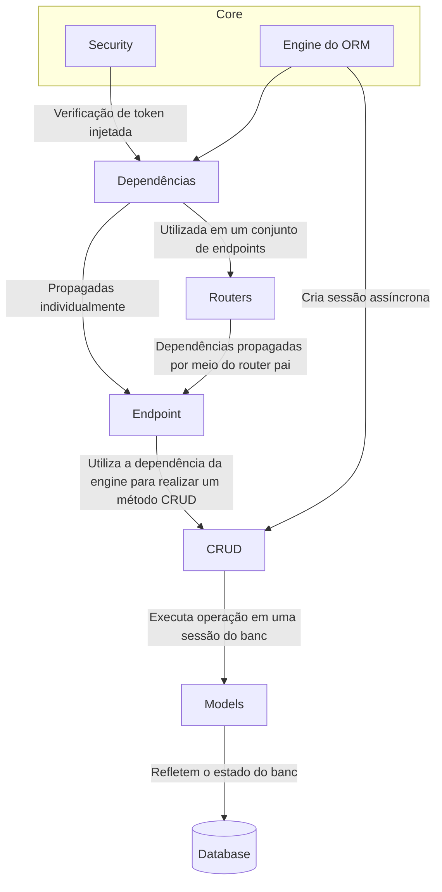
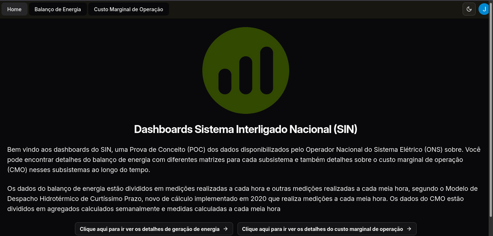
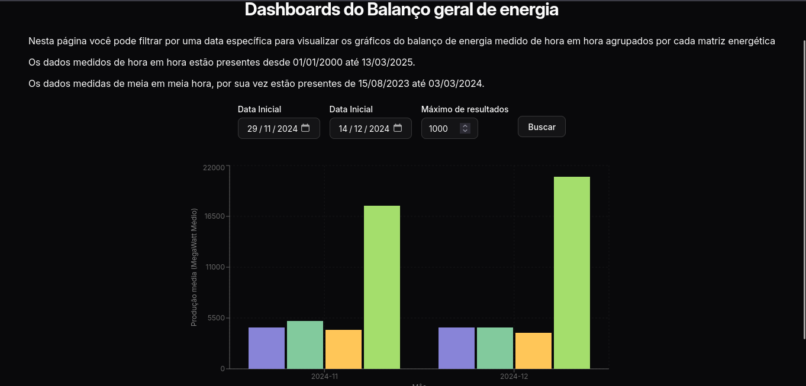
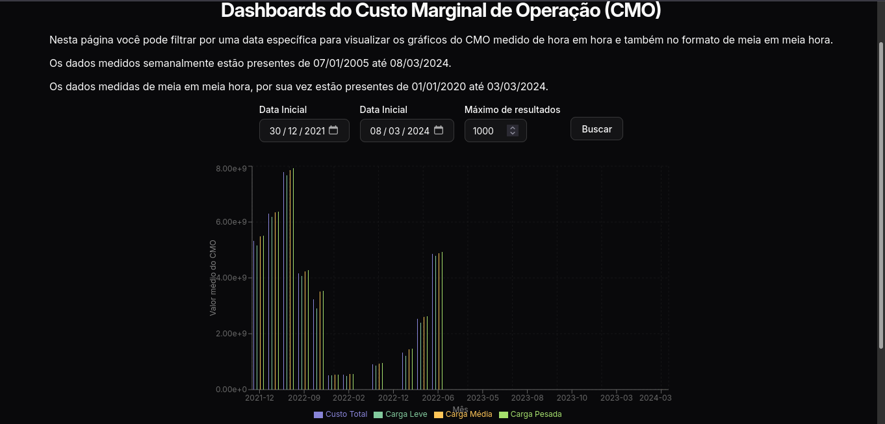

# Desafio Igeos 

Projeto para o desafio da Igeos, integrado ao serviço Auth0 para autenticação, com backend feito em FastAPI,  e frontend com React e Shadcn UI.

Nas duas aplicações segui uma arquitetura em camadas, e em cada uma haviam particularidades que destaco a seguir.
- No backend distribuí semelhantemente ao padrão MVC, com a presença de algumas camadas intermediárias seguindo os padrões mais comuns no FastAPI. E utilizando o sistema nativo de injeção de dependências para facilitar a autenticação e comunicação com o banco.


- No frontend, a arquitetura seguiu um formato mais simples, mas igualmente escalável. Boa parte da complexidade em interações com o back-end foi extraída para hooks personalizados (o que facilitaria um encapsulamento futuro com bibliotecas como Axios). Adicionalmente, os componentes foram criados com o uso do Shadcn UI, sendo facilmente expansíveis e podendo ser modificados diretamente para atendar alguma necessidade mais específica.

## Objetivo

Fornecer uma forma simplificada de visualizar os dados das Estimativas de custos da operação do Sistema Interligado Nacional (SIN), com gráficos de apresentação e opções de filtragem.

## Execução

Para executar a aplicação com Docker é necessário realizar os seguintes passos:

1. Criar um arquivo .env na raiz do projeto com as seguintes variáveis de ambiente:
```
DB_USER=<usuario_desejado_para_o_banco>
DB_PASSWORD=<senha_desejada_para_o_banco>
DB_NAME=<nome_desejado_para_o_banco>
```
2. Criar um arquivo .env na pasta `backend` com as seguintes variáveis:
```
AUTH0_DOMAIN=dev-cs56io82okt8qfik.us.auth0.com
AUTH0_ISSUER=https://dev-cs56io82okt8qfik.us.auth0.com/
AUTH0_AUDIENCE=https://sin-dashboard/api
AUTH0_ALGORITHM=RS256
```
> Esses valores não são secretos e são utilizados também no frontend

3. Inicializar os containers com o comando:
```console
docker compose up backend-prod database frontend
```
4. Executar o script para popular o banco: 
```console
docker exec -it backend-prod sh -c "./.venv/bin/python scripts/load_tables.py"
```

Após isso você poderá acessar a API e o frontend nos endereços:
- http://localhost:8000/docs 
- http://localhost:3000

respectivamente.

> **Nota:** como as rotas requerem o acesso de um usuário autenticado, o retorno delas é obtido apenas no frontend, mas você ainda pode visualizar os detalhes dos parâmetros e esquema dos endpoints. Para disponibilizar a API ao público seria necessária apenas incluir uma rota que redirecionasse o usuário para o login do Auth0.


## Decisões

### Backend
- **Endpoints em português:** pelo fato da API conter dados referentes a um contexto específico de uma empresa nacional, optei por descrever os endpoints da aplicação em português, para seguir o padrão de outras APIs constantemente utilizadas para a ciência de dados, como a do IBGE e também facilitar a consulta e reduzir a necessidade de memorização por engenheiros de dados interessados.
- **Importar dados do BigQuery em um banco SQL:** para garantir uma consistência maior, uma opção era utilizar o BigQuery diretamente com os endpoints da API, já que não haveria mudança significativa na performance, mas optei por carregar essas informações em um banco próprio. Outra decisão, foi a de não utilizar o BigQuery na extração para o banco da API, em vez disso criei um script de extração com Playwright e Polars. 
  - **Prós**
    - Ambiente de desenvolvimento mais simples de configurar, dispensando integração com a Google Cloud.
    - Maior simplicidade no uso, com a possibilidade de utilizar um ORM que não seria possível se o BigQuery fosse utilizado diretamente no Backend.
    - Menos problemas com disponibilidade, uma mudança no esquema das tabelas no BigQuery não afetaria a aplicação.
  - **Contras**
    - Possibilidade de inconsistência, como os dados são copiados para um banco próprio, atualizações no BiQquery não seriam refletidas no backend. Para compensar isso criei o script de extração da forma mais desacoplada possível, sem utilizar o ORM ou qualquer outra informação da API, assim seria simples mover esse script para um pipeline independente da API.
    - Menor performance pela leitura de múltiplos arquivos. Como a integração com o Google Cloud exige etapas de configuração local custosas, preferi sacrificar a ótima performance das queries com o bigquery pela simplificação dos containers executados localmente, evitando vendor locking e favorecendo a execução local.
- **Polars em vez de Pandas:** para o processamento dos arquivos eu escolhi a biblioteca Polars em vez da alternativa mais popular, o Pandas.
  - **Prós**
    - Permite definir um esquema para os dataframes, facilitando o desacoplamento da extração de dados dos modelos definidos na API
    - Maior eficiência na leitura de CSVs
  - **Contras**
    - Menor integração com outras ferramentas (existe um pacote que permite executar queries do BigQuery no Pandas)

### Frontend
- **React-Router em vez de Next.js, Angular, etc.**: Optei por utilizar a nova versão 7 do React Router, que funciona também como framework, para priorizar a simplicidade e extensibilidade. 
    - **Prós:**
      - Configuração mais rápida, dispensando muitas etapas não necessárias no começo
      - Pelo fato de haver menor complexidade, o bundle gerado também é menor que outras alternativas
    - **Contras:** 
      -  Escalabilidade menor, em um time maior as modificações com padrões mais relaxados dificultariam a manutenção ao longo do tempo. Ainda assim, essa versão é adequada como uma Prova de Conceito (POC).
- **Utilizar a biblioteca Shadcn em vez de outra como Material UI:** Inicialmente planejei incluir a biblioteca Material UI, porém não havia compatibilidade com o React 19 na versão estável atual, portanto optei pela biblioteca Shadcn UI, mas ainda estendi o tema de cores com cores do Material UI.
    - **Prós**
      - Tamanho menor, com o Shadcn é possível adicionar apenas os componentes que serão utilizados
      - Estilização pré-pronta, boa parte dos componentes já vêm com a estilização necessária, agilizando o desenvolvimento
    - **Contras**
      - Necessidade de muitas integrações, pelo fato de os componentes serem feitos da forma mais simples possível a maior parte deles precisa de múltiplas bibliotecas para ter um funcionamento adequado.
- **React Hook Form e Zod para validar parâmetros de requisição:** Normalmente uma biblioteca específica para requisições HTTP seria usada, mas devido a simplicidade das requisições e o número pequeno de endpoints com parâmetros em comum, escolhi utilizar uma validação de esquema com Zod e React-Hook-Form para criar os parâmetros de filtro de acordo com os valores informados pelo usuário.
    - **Prós**
      - Menos responsabilidade no Backend, é possível já validar se os parâmetros atendem as condições necessárias antes de enviar uma requisição à API.
      - Mais segurança na tipagem de formulários, com o uso dessas bibliotecas é possível validar cada campo de formulário e fornecer uma responsividade maior aos usuários em caso de erros. 
    - **Contras**
      - Acoplamento entre camadas, ao realizar essa validação com o Zod, a camada de visualização passa a ter mais informações sobre camadas mais internas, o que pode dificultar a manutenção caso essa validação seja utilizada para todas as requisições ao backend. Para reduzir esse problema utilizei hooks personalizados, abstraindo parte da lógica das requisições.

## Capturas de tela




## Créditos

Todos os dados utilizados foram disponibilizados pela ONS e podem ser acessados nestes links:
- [Base dos dados](https://basedosdados.org/dataset/51ee8a6c-e410-4fc2-b2a4-e778c5b1ef3d?table=baf92a7b-a69e-4187-8656-6c1234a0724b)
- [Dados Abertos ONS](https://dados.ons.org.br/)
